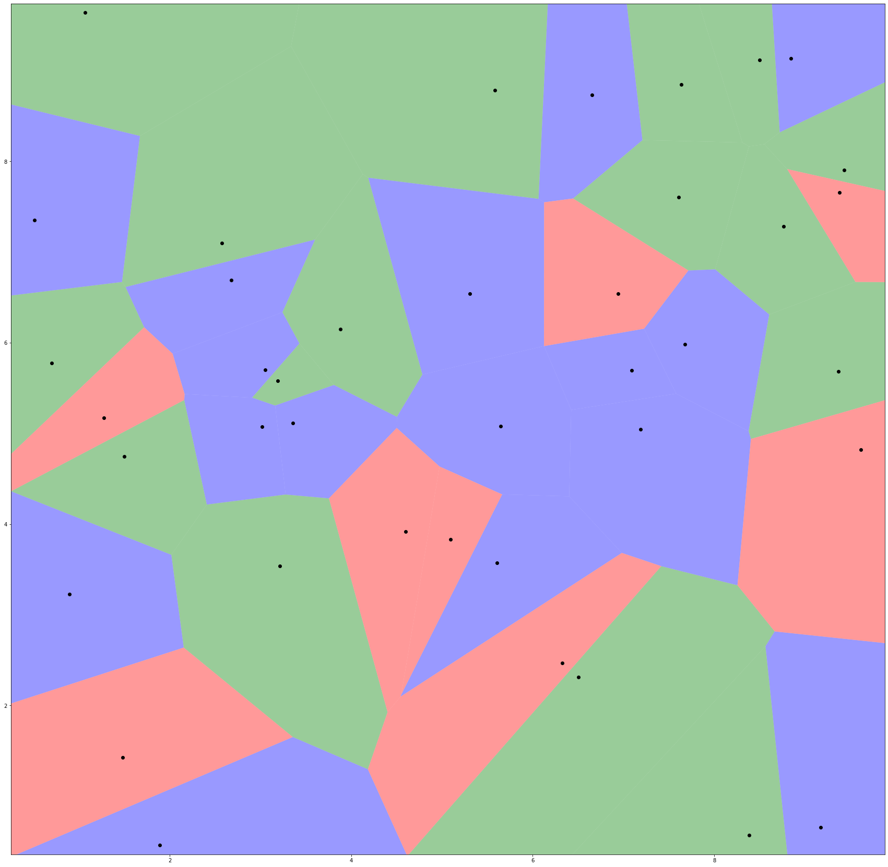
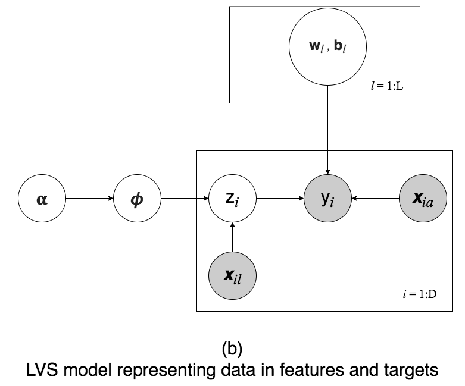

# LVS-geospatial-reasoning
MIE1516 course final project

## Motivation
Geospatial data is data about objects, events, or phenomena that have a location on the surface of the earth.[3]
The widespread use of geospatial data enables lots of scientific studies and real-world applications. For
example, geospatial data allows researchers to predict natural disasters[2, 6], predict forest fire[5], to study
epidemiology[4], to predict house prices [1], and even crime rates [7].
However, existing geospatial prediction methods often fail to capture piecewise sharp boundaries. Therefore,
the LVS(latent Voronoi Spatial) model was proposed by Ga Wu et al. to support geospatial predictions. In the
LVS model, each data point defines a Voronoi cell to maintain the granularity of spatial representation. In
this project, I would like to build on the LVS model to perform short-term rental price prediction with spatial
features.

## Research question
My research questions for this project are: (1) Can LVS model predict short-term rental prices with low RMSE
error? (2) How does LVS perform compared to KNN with sparse data?

## Data
Used synethic data with piecewise boundaries:

## Model

## References
[1] BOURASSA, S., CANTONI, E., AND HOESLI, M. Predicting house prices with spatial dependence: A
comparison of alternative methods. Journal of Real Estate Research 32 (04 2010), 139–160.

[2] DESCHAMPS, A., GREENLEE, D., PULTZ, T. J., AND SAPER, R. Geospatial data integration for applications
in flood prediction and management in the red river basin. In IEEE International Geoscience and Remote
Sensing Symposium (June 2002), vol. 6, pp. 3338–3340 vol.6.

[3] LAYTON, R., AND WATTERS, P. Automating Open Source Intelligence: Algorithms for OSINT. 01 2015.

[4] LOPEZ, D., GUNASEKARAN, M., MURUGAN, B. S., KAUR, H., AND ABBAS, K. M. Spatial big data analytics
of influenza epidemic in vellore, india. In 2014 IEEE International Conference on Big Data (Big Data) (Oct
2014), pp. 19–24.

[5] TEHRANY, M., JONES, S., SHABANI, F., MART´INEZ-´A LVAREZ, F., AND TIEN BUI, D. A novel ensemble
modelling approach for the spatial prediction of tropical forest fire susceptibility using logitboost machine
learning classifier and multi-source geospatial data. Theoretical and Applied Climatology (09 2018).

[6] THAO, N., HOANG, N.-D., PRADHAN, B., QUANG KHANH, N., TRUONG, T., QUANG MINH, N., SAMUI, P.,
AND TIEN BUI, D. Novel hybrid swarm optimized multilayer neural network for spatial prediction of flash
flood at tropical area using sentinel-1 sar imagery and geospatial data. Sensors (10 2018).

[7] ZHUANG, Y., ALMEIDA, M., MORABITO, M., AND DING, W. Crime hot spot forecasting: A recurrent model
with spatial and temporal information. In 2017 IEEE International Conference on Big Knowledge (ICBK)
(Aug 2017), pp. 143–150.
